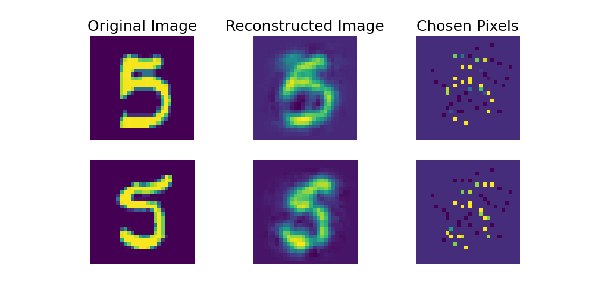
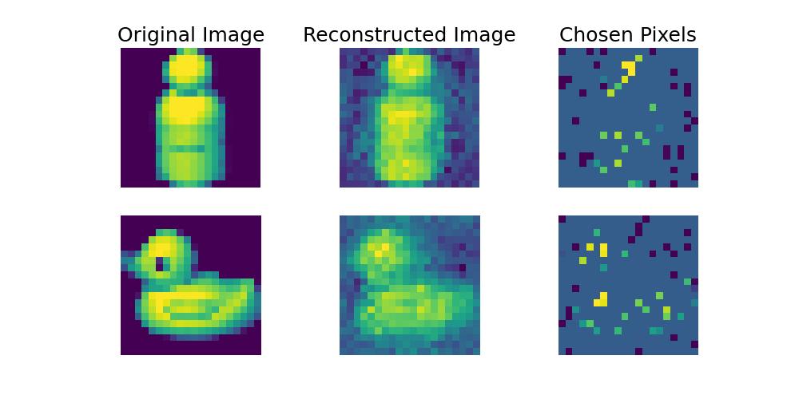

# INVASE () Pytorch :

INVASE[1] is a highly flexible feature selection framework. Given a sample from the dataset, INVASE model tries to select features that are most predictive for the given task on the instance level. Here we give a PyTorch implementation of the INVASE. Original implementation can be found in: https://github.com/jsyoon0823/INVASE 

## Example Runs:
### Vanilla Invase in Synthetic Datasets or MNIST:
`python train_invase.py --data_type syn4 --train_no 10000 --test_no 10000 --dim 11 --actor_h_dim 100 --critic_h_dim 200 --n_layer 3 --batch_size 1000  --activation relu --learning_rate 0.0001 --lamda 0.1`  
`python train_invase.py --data_type mnist --batch_size 1000  --activation relu --learning_rate 0.0001 --lamda 10 --eval-freq 1 --max-epochs 10`

### General comments:
To run on GPU, add `--device cuda` as an argument to the scripts. By default, it will run on CPU.  

## Extra:
### Decoding Analysis:
Below we implement a similar analysis as in Concrete Autoencoders(CAE)[2].   
Particularly, given an image, we use a feature selection algorithm (in this case INVASE) to select k pixels. Using those pixels, the task is to decode the whole image using a linear decoder. Below figure has a depiction of this in MNIST and COIL20 datasets:
  **MNIST**

**COIL20**

The main purpose of this experiment is to serve as a quantitative benchmark. Below you can see the comparison against results in the CAE paper. Algorithms are compared in terms of reconstruction MSE(mean squared error) in pixel space:  

## References:
[1] Jinsung Yoon, James Jordon, Mihaela van der Schaar, "INVASE: Instance-wise Variable Selection using Neural Networks", International Conference on Learning Representations (ICLR), 2019. (https://openreview.net/forum?id=BJg_roAcK7)  
[2] Abubakar Abid, Muhammed Fatih Balin, and James Zou. "Concrete autoencoders for differentiablefeature selection and reconstruction", International Conference on Machine Learning (ICML), 2019.